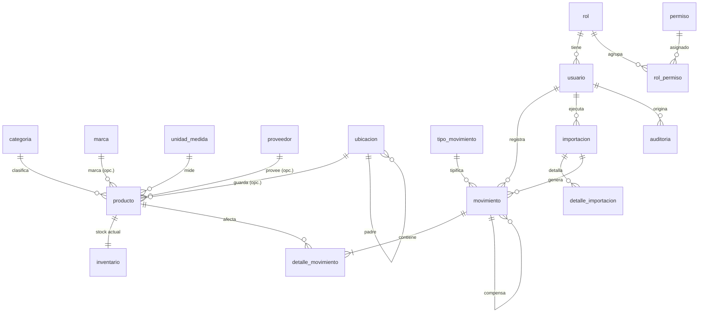

# 05 — Modelo de Datos (Escenario local)

**Fuente de verdad:** [db/001_schema.sql](db/001_schema.sql) (estructura, índices, triggers) y [db/002_seed.sql](db/002_seed.sql) (roles, permisos, unidades, tipos de movimiento, configuración).  
Convenciones en [04_Decisiones_Arquitectura_y_Reglas.md](04_Decisiones_Arquitectura_y_Reglas.md) §2.

## 1. Diagrama entidad-relación



## 2. Diccionario resumido

| Tabla | Propósito | Claves y restricciones destacadas |
|---|---|---|
| `configuracion` | Parámetros clave/valor | PK `clave` |
| `rol`, `permiso`, `rol_permiso` | RBAC | `codigo` único |
| `usuario` | Cuentas | `username` único (NOCASE), `rol_id`, bloqueo por intentos |
| `categoria`, `marca`, `unidad_medida`, `proveedor`, `ubicacion` | Catálogos | nombre/código único (NOCASE), `activo`; `ubicacion.padre_id` jerárquico |
| `producto` | Maestro | `codigo` único NOCASE (la aplicación genera `LEGACY-…` si no hay código externo); índice único parcial de `codigo_barras` solo activos; `stock_maximo` se conserva solo como legado |
| `inventario` | Stock actual (1:1 con producto) | Creada por trigger al insertar producto; solo la modifica `MovimientoService` |
| `tipo_movimiento` | Catálogo de movimientos | `naturaleza` fija el signo (ENTRADA/AJUSTE_POS=+1; SALIDA/AJUSTE_NEG=?1) |
| `movimiento` | Cabecera | Inmutable; `importacion_id` y `movimiento_origen_id` opcionales |
| `detalle_movimiento` | Línea | `cantidad>0`, `signo`, `stock_resultante = stock_anterior + signo*cantidad` (CHECK); inmutable; no admite productos inactivos |
| `importacion`, `detalle_importacion` | Historial y staging de CSV | `estado`, contadores, `hash_sha256`, `datos_json`/`errores_json` por fila |
| `auditoria` | Bitácora | Solo anexado; `valor_anterior`/`valor_nuevo` en JSON |

## 3. Consultas de referencia

```sql
-- Alertas (RB-08)
SELECT p.codigo, p.nombre, i.cantidad,
  CASE WHEN i.cantidad <= 0 THEN 'SIN_STOCK'
       WHEN p.stock_minimo IS NOT NULL AND i.cantidad <= p.stock_minimo THEN 'BAJO_MINIMO'
  END AS alerta
FROM producto p JOIN inventario i ON i.producto_id = p.id
WHERE p.activo = 1;

-- Valor de inventario (RB-09), en unidades escaladas: dividir entre 1000 * 10000
SELECT SUM(CAST(i.cantidad AS REAL) * p.precio_compra) / 1e7
FROM producto p JOIN inventario i ON i.producto_id = p.id
WHERE p.activo = 1 AND p.precio_compra IS NOT NULL;

-- Verificación de consistencia: stock vs. suma de movimientos (debe devolver 0 filas)
SELECT i.producto_id FROM inventario i
LEFT JOIN (SELECT producto_id, SUM(signo*cantidad) AS s FROM detalle_movimiento GROUP BY producto_id) m
  ON m.producto_id = i.producto_id
WHERE i.cantidad <> COALESCE(m.s, 0);
```

> La última consulta debe ejecutarse al final de las pruebas de inventario e importación como invariante.

## 4. Estrategia de migraciones

1. `0001_initial`: equivalente a `001_schema.sql` + `002_seed.sql`.
2. Cada cambio posterior es una migración Alembic con `render_as_batch=True` (SQLite) y su prueba de subida desde una BD de la versión anterior.
3. Al abrir la BD, la aplicación compara `alembic_version` con la esperada; si la BD es más nueva que el código, no arranca; si es más antigua, ofrece migrar tras crear un backup automático.

## 6. Ajuste operativo R&R

La categoría se administra como catálogo funcional editable y se siembran las 17 categorías iniciales de R&R. La migración `0003_rr_product_model` desactiva stock máximo y carga esas categorías en bases existentes sin eliminar catálogos ni productos. La aplicación aún usa la unidad del maestro para validar movimientos; eliminarla requiere rediseñar el detalle de movimiento por presentación.

## 5. Puntos abiertos del modelo

- Si el cliente confirma lotes/vencimientos/series (decisiones 6–8), habrá que reemplazar `inventario(producto_id)` por stock por lote y añadir `lote_id` al detalle. Confirmar **antes** de la Entrega 2.
- Si el identificador único real no es `codigo` (decisión 3), cambiar antes de la Entrega 1.
