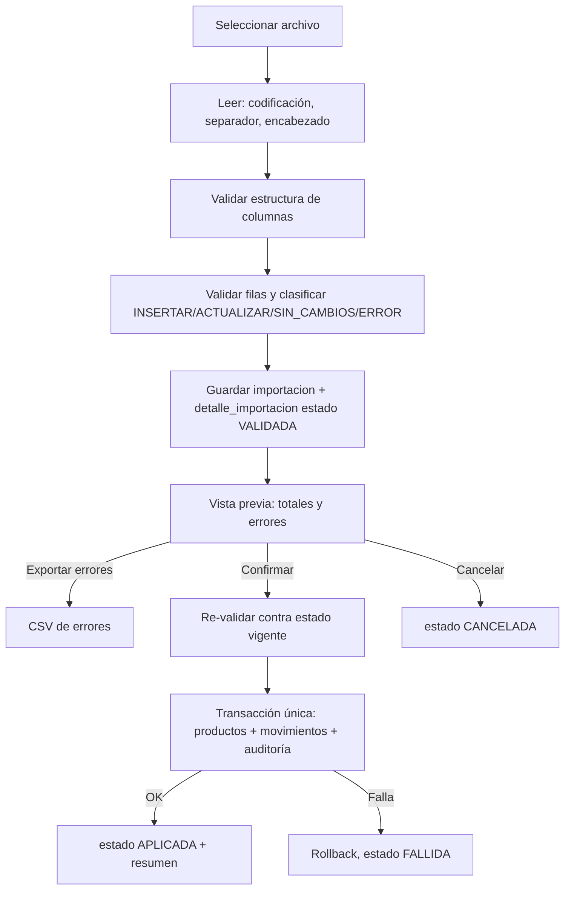

# 06 — Especificación de Importación CSV

Ejemplos: [samples/productos_valido.csv](samples/productos_valido.csv) y [samples/productos_con_errores.csv](samples/productos_con_errores.csv).  
Es una **propuesta inicial**: debe contrastarse con un CSV real del cliente (Fase 0) y ajustar el mapeo de columnas.

## 1. Formato de archivo

| Aspecto | Regla |
|---|---|
| Codificación | Autodetección: UTF-8 (con o sin BOM); si falla, Windows-1252. Seleccionable en el asistente. |
| Separador | Autodetección entre `,` `;` `\t` `\|`; seleccionable. |
| Encabezado | Obligatorio en la primera fila; nombres sin distinguir mayúsculas ni acentos; `trim`. Columnas desconocidas se ignoran con advertencia. |
| Decimal | `.` por defecto; seleccionable `,`. Sin separador de miles. |
| Fechas | `YYYY-MM-DD` (reservado; no usado en este MVP). |
| Tamaño | Máximo `importacion.max_filas` (50 000). Lectura en streaming. |
| Filas vacías | Se ignoran. |

## 2. Columnas

| Columna | Alta | Actualización | Tipo / regla |
|---|---|---|---|
| `codigo` | Opcional | Obligatoria (clave) | Texto ? 50, `trim`; único cuando se informa. En alta sin código se genera un identificador interno `LEGACY-…` |
| `nombre` | Obligatoria | Opcional | Texto ? 200 |
| `categoria` | Obligatoria | Opcional | Nombre existente en catálogo |
| `unidad` | Obligatoria | Opcional | Código o nombre de unidad existente. En actualización **no** puede cambiar si el producto tiene movimientos |
| `codigo_barras` | Opcional | Opcional | Texto ? 50; único entre activos |
| `descripcion` | Opcional | Opcional | Texto |
| `marca` | Opcional | Opcional | Nombre existente |
| `proveedor` | Opcional | Opcional | Nombre existente |
| `ubicacion` | Opcional | Opcional | Código existente |
| `precio_compra` | Opcional | Opcional | Decimal ? 0, hasta 4 decimales |
| `precio_venta` | Opcional | Opcional | Decimal ? 0, hasta 4 decimales |
| `stock_minimo` | Opcional | Opcional | Decimal ? 0 (respeta decimales de la unidad) |
| `stock` | Opcional | Opcional | Decimal ? 0. Solo se aplica con la opción "Aplicar stock" |
| `estado` | Opcional | Opcional | `ACTIVO` o `INACTIVO`; vacío = `ACTIVO` en alta |
| `observaciones` | Opcional | Opcional | Texto |

**Semántica de celdas vacías en actualización:** vacío = *no modificar*. Para limpiar un valor opcional se usa el token `[BORRAR]`.

## 3. Modos y opciones

| Modo | Comportamiento |
|---|---|
| `INSERTAR` | Fila con código existente ? error `E20`. Una fila sin código crea un producto con identificador interno. |
| `ACTUALIZAR` | Fila con código inexistente ? error `E21`. |
| `INSERTAR_ACTUALIZAR` | Crea o actualiza según exista. |

Opciones del asistente:

- **Crear catálogos faltantes** (categoría, marca, proveedor, ubicación): desactivada por defecto; requiere `catalogos.gestionar`. Si está desactivada, un valor inexistente es error `E04`. *Nota: los ejemplos de `samples/` suponen que los catálogos ya existen o que esta opción está activa.*
- **Aplicar stock**: requiere `movimientos.ajuste`.
  - Producto nuevo con `stock > 0` ? movimiento `ENT_INICIAL`.
  - Producto existente con `stock` distinto del actual ? movimiento `AJ_POSITIVO`/`AJ_NEGATIVO` por la diferencia, motivo `Importación CSV #<id>`.
  - Si no está activada, la columna `stock` se ignora (los productos nuevos nacen con 0).
- **Omitir filas con error** (solo ADMIN): aplica las filas válidas. Por defecto, si hay errores no se aplica nada (RI-02).

## 4. Flujo

- La aplicación se ejecuta en una **única transacción** (`BEGIN IMMEDIATE`). Con 50 000 filas se procesa por lotes dentro de la misma transacción, emitiendo progreso a la UI mediante *callback* (la UI corre la tarea en un hilo de trabajo).
- Re-validar al confirmar evita aplicar una vista previa obsoleta; si hay diferencias, se muestra la nueva vista previa.
- Se calcula SHA-256 del archivo; si coincide con una importación `APLICADA`, advertir y pedir confirmación (RI-03).

## 5. Catálogo de errores

| Código | Descripción |
|---|---|
| `E00` | Columna obligatoria faltante en el encabezado (bloquea todo el archivo) |
| `E01` | `codigo` vacío en modo `ACTUALIZAR` |
| `E02` | `codigo` duplicado dentro del archivo |
| `E03` | Campo obligatorio vacío en alta |
| `E04` | Categoría/marca/proveedor/ubicación/unidad inexistente |
| `E05` | Valor numérico inválido |
| `E07` | Decimales no permitidos por la unidad |
| `E08` | Valor negativo no permitido |
| `E09` | `estado` fuera de dominio |
| `E10` | Longitud excedida |
| `E11` | `codigo_barras` ya usado por otro producto activo (o repetido en el archivo) |
| `E20` | Modo `INSERTAR` y el producto ya existe |
| `E21` | Modo `ACTUALIZAR` y el producto no existe |
| `E22` | Cambio de unidad en producto con movimientos |
| `E23` | Producto inactivo con `stock` para aplicar |
| `E24` | Stock resultante inválido |

Archivo de errores exportable: `fila, codigo, columna, error_codigo, mensaje, valor_original`.

## 6. Pruebas mínimas (derivadas del doc 03, Fase 7)

CSV vacío · sin encabezado · columna faltante · separador `;` con decimal `,` · BOM UTF-8 · Windows-1252 · duplicado interno · cada código de error E01–E24 · modo × (nuevo/existente) · archivo de 50 000 filas · interrupción simulada a mitad de aplicación (debe quedar sin cambios) · reimportación del mismo archivo · invariante stock = ? movimientos tras importar.
