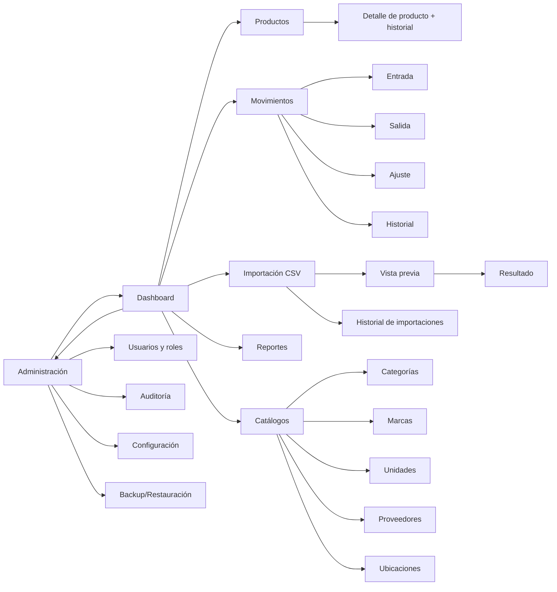

# 07 — Permisos, Casos de Uso y Pantallas

## 1. Matriz de permisos (valores iniciales de [db/002_seed.sql](db/002_seed.sql))

| Permiso | ADMIN | OPERADOR | CONSULTA |
|---|:-:|:-:|:-:|
| `usuarios.gestionar` | ? | | |
| `catalogos.ver` | ? | ? | ? |
| `catalogos.gestionar` | ? | | |
| `productos.ver` | ? | ? | ? |
| `productos.ver_precios` | ? | ? | |
| `productos.crear` | ? | ? | |
| `productos.editar` | ? | ? | |
| `productos.desactivar` | ? | | |
| `inventario.ver` | ? | ? | ? |
| `movimientos.entrada` | ? | ? | |
| `movimientos.salida` | ? | ? | |
| `movimientos.ajuste` | ? | | |
| `importacion.ejecutar` | ? | ? | |
| `importacion.historial` | ? | ? | |
| `reportes.ver` | ? | ? | ? |
| `exportar.datos` | ? | ? | ? |
| `auditoria.ver` | ? | | |
| `configuracion.gestionar` | ? | | |
| `backup.gestionar` | ? | | |

Regla de implementación: los casos de uso de `application` verifican el permiso con un `AuthorizationService` (no solo la UI oculta botones). La sesión actual (`CurrentUser` con su conjunto de permisos) se inyecta en los casos de uso.

## 2. Mapa de navegación

## 3. Catálogo de pantallas

| ID | Pantalla | Permiso | Contenido clave | Estados a diseñar |
|---|---|---|---|---|
| S-01 | (Retirada en modo local) Asistente primer arranque | — | Reemplazada por `LocalSessionService`: sin pantalla | — |
| S-02 | (Retirada en modo local) Login | — | La aplicación abre directo en el Dashboard; el login se reactiva en la versión multiusuario | — |
| S-03 | Dashboard | cualquiera | Indicadores (doc 01 RF-080), alertas con enlace al listado filtrado, accesos rápidos | cargando, sin datos |
| S-04 | Listado de productos | `productos.ver` | Búsqueda rápida, filtros combinables (RF-061), paginación, columnas de stock/alerta, limpiar filtros | vacío, sin resultados, cargando |
| S-05 | Alta/edición de producto | `productos.crear/editar` | Campos RF-010, validación en línea | error de duplicado, guardado OK |
| S-06 | Detalle de producto | `productos.ver` | Ficha, stock, alertas, historial (RF-033) | inactivo |
| S-07 | Catálogos (5 pantallas tipo maestro/detalle) | `catalogos.*` | CRUD + desactivar | duplicado, en uso |
| S-08 | Entrada | `movimientos.entrada` | Cabecera + líneas (producto, cantidad), tipo, fecha, documento | producto inactivo |
| S-09 | Salida | `movimientos.salida` | Igual + muestra stock disponible | stock insuficiente |
| S-10 | Ajuste | `movimientos.ajuste` | Producto, nuevo stock o diferencia, motivo obligatorio | sin motivo |
| S-11 | Historial de movimientos | `inventario.ver` | Filtro por producto, tipo, fecha, usuario | vacío |
| S-12 | Importación: selección y opciones | `importacion.ejecutar` | Archivo, codificación, separador, decimal, modo, opciones | archivo inválido |
| S-13 | Importación: vista previa | ídem | Totales, tabla de filas con acción/errores, exportar errores | con errores, sin errores |
| S-14 | Importación: resultado/progreso | ídem | Barra de progreso, resumen final | éxito, fallo con rollback |
| S-15 | Historial de importaciones | `importacion.historial` | Lista y detalle | — |
| S-16 | Reportes | `reportes.ver` | Elegir reporte, filtros, vista previa, exportar/imprimir | sin datos |
| S-17 | Usuarios y roles | `usuarios.gestionar` | CRUD usuarios, reiniciar contraseña, activar/desactivar | último ADMIN |
| S-18 | Auditoría | `auditoria.ver` | Filtro por fecha/usuario/entidad/acción, detalle JSON anterior/nuevo | — |
| S-19 | Configuración | `configuracion.gestionar` | Empresa, parámetros de inventario/seguridad | — |
| S-20 | Backup/Restauración | `backup.gestionar` | Crear, elegir destino, restaurar con advertencia, último respaldo | restauración fallida |
| S-21 | Cambio de contraseña | cualquiera | Actual, nueva, confirmar | política no cumplida |

Lineamientos UI: PySide6 con `QMainWindow` + navegación lateral; tablas con `QAbstractTableModel` y paginación del lado de la consulta; tareas largas (importación, reportes) en `QThread`/`QRunnable` sin bloquear la UI; atajos de teclado y orden de tabulación en formularios de movimientos (uso intensivo).

## 4. Casos de uso (complementan CU-001…CU-004 del doc 01)

### CU-005 — Registrar entrada
1. Abre S-08, elige tipo (ej. Compra), fecha y documento.
2. Agrega líneas producto/cantidad (valida RB-02, RB-05).
3. Confirma ? `MovimientoService.registrar` en una transacción: inserta `movimiento` + `detalle_movimiento` (stock anterior/resultante), actualiza `inventario`, audita.
4. Muestra resumen con stocks resultantes.

### CU-006 — Ajustar inventario
Igual que CU-005 con permiso `movimientos.ajuste` y motivo obligatorio; el usuario ingresa el stock contado y el sistema calcula la diferencia y el tipo (positivo/negativo).

### CU-007 — Corregir un movimiento
Un ADMIN selecciona un movimiento y usa "Corregir": el sistema genera un movimiento compensatorio con `movimiento_origen_id`, motivo obligatorio. No se edita ni borra el original (RN-M007 adaptada al local).

### CU-008 — Desactivar/reactivar producto
Valida RB-05/RB-06; audita; el historial se conserva.

### CU-009 — Crear y restaurar backup
Crear: elegir carpeta ? `.zip` con manifest ? mensaje con ruta y hash.  
Restaurar: advertencia ? backup previo automático ? validación (hash, integridad, versión) ? reemplazo ? reinicio de la aplicación.

### CU-010 — Gestionar usuarios
Crear usuario con contraseña temporal (cambio obligatorio), asignar rol, desactivar, reiniciar contraseña; aplica RB-10.

## 5. Mensajes funcionales mínimos (códigos estables)

| Código | Mensaje |
|---|---|
| `AUTH_INVALIDA` | Usuario o contraseña incorrectos. |
| `AUTH_BLOQUEADO` | Cuenta bloqueada temporalmente. Intente en {n} minutos. |
| `AUTH_INACTIVO` | El usuario está desactivado. |
| `SIN_PERMISO` | No tiene permiso para realizar esta acción. |
| `PRODUCTO_CODIGO_DUPLICADO` | Ya existe un producto con el código {codigo}. |
| `PRODUCTO_BARRAS_DUPLICADO` | El código de barras ya está en uso por {codigo}. |
| `PRODUCTO_INACTIVO` | El producto {codigo} está inactivo. |
| `STOCK_INSUFICIENTE` | Stock insuficiente de {codigo}: disponible {disp}, solicitado {sol}. |
| `CANTIDAD_INVALIDA` | La cantidad debe ser mayor que cero y respetar los decimales de la unidad. |
| `MOTIVO_REQUERIDO` | Debe indicar el motivo. |
| `CSV_ESTRUCTURA` | Faltan columnas obligatorias: {columnas}. |
| `CSV_CON_ERRORES` | El archivo tiene {n} filas con error. Revise o exporte el informe. |
| `BACKUP_INVALIDO` | El respaldo no es válido o es de una versión incompatible. |
| `ULTIMO_ADMIN` | No puede desactivar al último administrador activo. |
